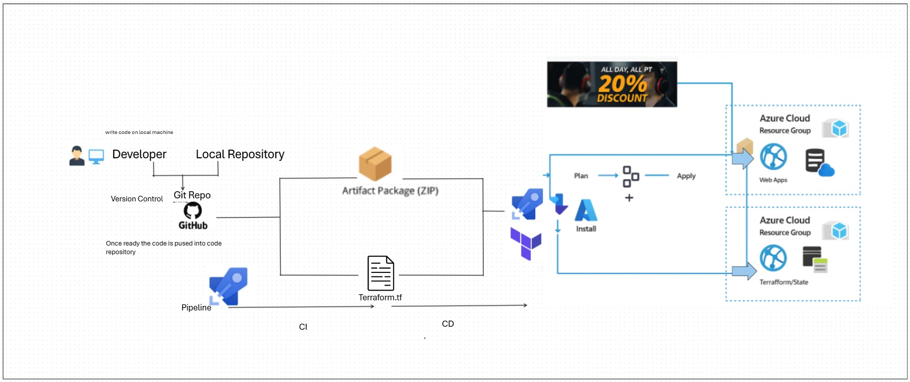

# 🚀 Azure IaC Automation Project

## Overview

This project automates the provisioning and management of Azure infrastructure using **Infrastructure as Code (IaC)** principles. It leverages:

- **Terraform** for declarative resource definitions  
- **Azure DevOps** for CI/CD pipeline orchestration  
- **Azure CLI** for scripting and validation  

---

## 💻 Tech Stack

- Terraform – Infrastructure provisioning  
- Azure CLI – Command-line interaction with Azure  
- Azure DevOps Pipeline – CI/CD pipeline automation  
- Git – Version control  
- Azure Resource Manager (ARM) – Backend infrastructure  
- Shell/Python Scripts – Custom automation tasks  

---

## 📁 Project Structure

\`\`\`
azure-iac-automation/
├── infra/
│   ├── main.tf
│   ├── variables.tf
│   ├── outputs.tf
│   └── provider.tf
├── pipelines/
│   ├── azure-pipelines.yaml
├── scripts/
│   └── create-service-connection.sh
├── README.md
├── Structural_Diagram_IaC.jpeg
\`\`\`

---



## ⚙️ Features

- Automated provisioning of:
  - Virtual Networks
  - Subnets
  - Network Security Groups
  - Virtual Machines
  - Storage Accounts
  - Azure Kubernetes Service (AKS)
- Environment-specific deployments (Dev, QA, Prod)
- State management using Azure Storage backend
- CI/CD integration with Azure Pipeline
- Modular and reusable Terraform code

---

## 🚦 CI/CD Pipeline

1. **Code Commit** → GitHub  
2. **Azure DevOps Pipeline** → Terraform Init & Plan  
3. **Approval Stage** → Manual or Automated  
4. **Terraform Apply** → Azure Resource Deployment  
5. **Post-deploy Scripts** → Configuration & Validation  

---

## 🔐 Security

- Secrets managed via Azure Key Vault  
- Role-based access control (RBAC)  
- Secure backend state storage  

---

## 📝 Prerequisites

- Azure Subscription  
- Azure DevOps Pipeline with Terraform integration  
- Azure CLI installed  
- Service Principal with Contributor role  

---

## 🚀 Getting Started

1. Push repo to GitHub:
\`\`\`bash
# Clone the repo
git clone https://github.com/NaureenRais/azure-iac-devops-automation.git
cd azure-iac-automation
cp -r ../azure-iac-automation/* .
git add .
git commit -m "Add IaC automation project"
git push origin main

# Initialize Terraform
terraform init

# Plan infrastructure
terraform plan -var-file="env/dev.tfvars"

# Apply infrastructure
terraform apply -var-file="env/dev.tfvars"
\`\`\`

---

2. Run the service connection script:
```bash
./scripts/create-service-connection.sh <ORG_NAME> <PROJECT_NAME> <SUBSCRIPTION_ID> <SUBSCRIPTION_NAME> <TENANT_ID> <APP_ID> <APP_SECRET>
```

3. In Azure DevOps → Pipelines → New Pipeline → GitHub → Select repo.

4. Run pipeline, Terraform will provision infra.


## 📌 TODOs

- [ ] Add monitoring and alerting setup  
- [ ] Integrate with GitHub Actions  
- [ ] Add unit tests for Terraform modules  

---

## 📄 License

This project is licensed under the **MIT License**.


